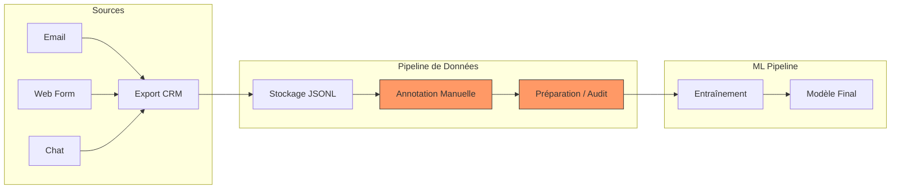

# Cycle de Vie des Données - Projet FastIA

Ce document décrit le flux de données, de la capture du besoin client jusqu'à l'obtention d'un modèle fine-tuné.

---

## 1. Chaîne d'approvisionnement actuelle
Les données proviennent de trois canaux d'entrée principaux simulés pour représenter l'activité de l'entreprise exemple :

* **Email :** Requêtes non structurées .
* **Formulaire Web :** Données semi-structurées via le site institutionnel (catégories pré-remplies par l'utilisateur).
* **Chatbot :** Requêtes courtes et directes.

**Processus de conversion :** Les messages ont été exportés depuis l'outil CRM client, puis convertis en format **JSONL (JSON Lines)** via un script Python. 

## 2. Cycle de vie actuel
1.  **Ingestion :** Extraction brute des messages clients du CRM.
2.  **Annotation (Manuelle) :** Un expert métier a ajouté les colonnes `categorie`, `priorite` et a rédigé la `reponse_suggeree`.
3.  **Stockage :** Fichier plat `dataset.jsonl` stocké localement ou sur un dossier partagé.
4.  **Préparation :** Vérification rapide de la structure (audit qualitatif). *Note : Aucune étape de nettoyage automatisée n'est en place actuellement.*

## 3. Schéma du flux
Voici la représentation visuelle du parcours de la donnée :

## 4. Points de rupture identifiés 

L'analyse du cycle actuel révèle plusieurs vulnérabilités majeures :

étapes non reproductibles, non versionnées, non monitorées